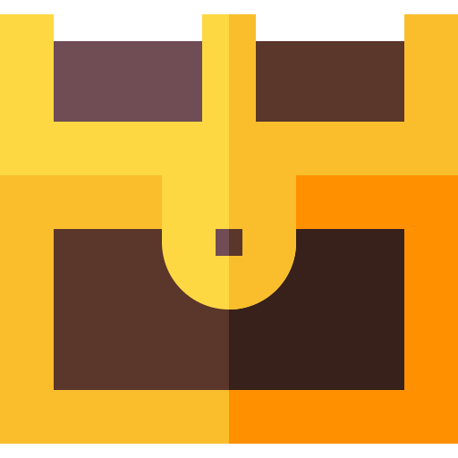

***

    
    <h3 style="margin-left: 10px;">Contact with me:</h3>

***

    
    <h3 style="margin-left: 10px;">Programming languages:</h3>

***

    
    <h3 style="margin-left: 10px;">Frameworks:</h3>

***

    
    <h3 style="margin-left: 10px;">Databases:</h3>

***

    
    <h3 style="margin-left: 10px;">Other technical skills:</h3>

